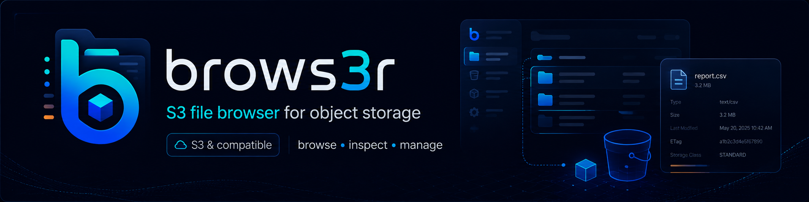

<p align="center">
  
</p>

<h1 align="center">brows3r</h1>

<p align="center">
  <em>A native S3 file browser for engineers — multi-profile, keyboard-first, with rich preview.</em>
</p>

<p align="center">
  <a href="https://github.com/banduk/brows3r/actions/workflows/ci.yml"></a>
  <a href="https://github.com/banduk/brows3r/actions/workflows/docs.yml"></a>
  <a href="https://your-org.github.io/brows3r/"></a>
  <a href="https://github.com/banduk/brows3r/releases/latest"></a>
  <a href="LICENSE"></a>
  
  
  
</p>

<p align="center">
  <strong>
    <a href="https://your-org.github.io/brows3r/">Documentation</a> ·
    <a href="https://your-org.github.io/brows3r/guide/getting-started">Get started</a> ·
    <a href="https://your-org.github.io/brows3r/concepts/architecture">Architecture</a> ·
    <a href="https://github.com/banduk/brows3r/releases">Releases</a> ·
    <a href="CONTRIBUTING.md">Contribute</a>
  </strong>
</p>

---

## Why brows3r?

The AWS console is slow. The CLI has no preview. Existing GUIs either pipe
credentials through a remote service or hide what they're doing. brows3r
is a desktop app for the people who live in S3 every day:

- **Engineers** who want to grep a 100k-key prefix and preview the
  matching CSV/Parquet without leaving the keyboard.
- **Data teams** who need to spot-check Glacier transitions, lifecycle
  rules, and replication state without writing a one-shot script.
- **DevOps** who manage multiple AWS accounts plus a MinIO or R2 bucket
  on the side, in the same workflow.

It's local-first. Credentials never leave your machine. There is no
hosted backend, no telemetry-by-default, no account to sign up for.

## Features

- **Multi-profile** — AWS native + S3-compatible (MinIO, R2, Wasabi,
  B2, LocalStack). Browse several profiles at once, one per pane.
- **Seven view modes** — Details, Icons, Gallery, Columns, Tree, Flat
  keys, Dual pane. Switch per-pane with <kbd>Cmd</kbd>+<kbd>1</kbd>–<kbd>7</kbd>.
- **Rich preview** — Images, video, audio, PDF (pdf.js), HTML
  (sandboxed render + source view), Markdown (GFM + highlight),
  archives, CSV/NDJSON/Parquet tables, text/code (Shiki), hex viewer
  for binaries. Best-effort text fallback for unknown types.
- **Monaco editor** — edit text files in place with ETag-precondition
  saves and a Refresh / Save-anyway conflict UI.
- **Keyboard-first** — <kbd>Cmd</kbd>+<kbd>K</kbd> command palette,
  <kbd>Cmd</kbd>+<kbd>F</kbd> recursive search, <kbd>/</kbd> fuzzy
  filter, <kbd>Cmd</kbd>+<kbd>L</kbd> breadcrumb edit, full keyboard
  navigation in every view.
- **Bulk operations** — drag-and-drop upload, recursive download, copy
  / cut / paste / rename / move / delete / create folder / presigned
  URL. Optimistic UI with transactional rollback.
- **Bookmarks** at any level (bucket / folder / object) with
  auto-pruning when a profile is deleted. Auto-tracked Recents.
- **Inspector** — bucket metadata (versioning, encryption, lifecycle,
  policy, replication) and object metadata (ACL, tags, locks, versions,
  storage class transitions).
- **Multipart cleanup** — Settings panel that scans for orphaned
  multipart uploads and aborts them.
- **Performance** — virtualized rows, infinite scroll, off-thread fuzzy
  filter via Web Worker, capability cache that mutes unsupported
  operations instead of failing them noisily.
- **Honest about S3 limitations** — "Move" is a copy-then-delete with
  rollback; recursive operations are paged; capability gaps surface as
  disabled controls, never red banners.

## Architecture in one diagram

```
┌──────────────── Tauri process ────────────────┐
│  WebView (React 19 + Vite + TS)               │
│   - Zustand UI state                          │
│   - TanStack Query (short-lived render cache) │
│   - Monaco · Shiki · PDF.js (all lazy)        │
│        │  invoke / listen                     │
│        ▼                                      │
│  Rust core                                    │
│   - profile_manager   - cache (SWR)           │
│   - s3_client_pool    - transfer_queue        │
│   - capability_cache  - resource_locks        │
│   - keychain          - settings              │
│   - media_server (loopback, signed tokens)    │
│        │                                      │
│        ▼                                      │
│  aws-sdk-s3 (per-profile, per-region clients) │
└────────────────────────────────────────────────┘
                       │
                       ▼
         AWS S3 / MinIO / R2 / Wasabi / …
```

Three load-bearing constraints drive every decision:

1. **AWS credentials never cross the IPC boundary** — the WebView only
   sees opaque request IDs and signed loopback URLs.
2. **Rust is the authoritative cache** — TanStack Query is a short-lived
   render adapter, never the source of truth.
3. **Capability gaps feel intentional** — unsupported S3 operations are
   classified once, cached per (profile, bucket, operation), and
   surfaced as disabled controls with subtle reasons.

Full architecture deep-dive:
[Concepts → Architecture](https://your-org.github.io/brows3r/concepts/architecture).

## Install

### From a release

Signed binaries for macOS, Linux, and Windows are attached to every tagged
release on the [Releases page](https://github.com/banduk/brows3r/releases).

### From source

```sh
git clone https://github.com/banduk/brows3r
cd brows3r
pnpm install
pnpm tauri dev
```

Prerequisites:

- Node 22+, pnpm 10+
- Rust toolchain 1.95+
- Platform deps: macOS (none extra) · Linux
  (`libwebkit2gtk-4.1-dev`, `libssl-dev`, `libayatana-appindicator3-dev`,
  `librsvg2-dev`, `libgtk-3-dev`) · Windows (MSVC Build Tools, WebView2
  preinstalled on Win11)

The first cold build takes 5–10 minutes (cargo compiles the AWS SDK and
~300 transitive crates). Subsequent runs are incremental.

## Development

```sh
pnpm dev              # frontend only (Vite at :1420)
pnpm tauri dev        # full desktop app

pnpm lint             # Biome
pnpm typecheck        # tsc --noEmit
pnpm test --run       # Vitest (no LocalStack required)
pnpm docs:dev         # docs site at :5173

# Rust:
cargo test --workspace --all-targets --manifest-path src-tauri/Cargo.toml
cargo clippy --workspace --all-targets --manifest-path src-tauri/Cargo.toml
```

Rust integration tests that need a live S3 backend (LocalStack) are gated
behind `--features integration` and skipped by default. See
[`docs/contributing/dev.md`](docs/contributing/dev.md) for the full
toolchain and conventions.

## Building a release bundle locally

```sh
pnpm tauri build
# or, with the helper that prints artifact paths:
./scripts/build-local.sh
```

Output lands in `src-tauri/target/release/bundle/`. Unsigned binaries
trigger Gatekeeper / SmartScreen warnings on first launch. Signed releases
go through the `release.yml` workflow on tagged pushes; see
[`docs/contributing/release.md`](docs/contributing/release.md) for the
full signing runbook.

## Documentation

The full documentation site lives at
**[your-org.github.io/brows3r](https://your-org.github.io/brows3r/)** and
is rebuilt from this repo on every push to `main`:

- [Guide](https://your-org.github.io/brows3r/guide/getting-started) —
  install, profile setup, view modes, preview, bulk ops, bookmarks,
  inspector, multipart cleanup.
- [Concepts](https://your-org.github.io/brows3r/concepts/architecture) —
  architecture, credential boundary, cache and SWR, media loopback server,
  capability cache, performance budgets, accessibility.
- [Contributing](https://your-org.github.io/brows3r/contributing/) — dev
  environment, release process, security policy, release checklist.
- [API reference (TypeScript)](https://your-org.github.io/brows3r/api/ts/) —
  TypeDoc-generated from JSDoc/TSDoc comments.
- [API reference (Rust)](https://your-org.github.io/brows3r/api/rust/brows3r/) —
  rustdoc-generated.

## Contributing

PRs and issues welcome. Start with [CONTRIBUTING.md](CONTRIBUTING.md), then
the [Contributing guide on the docs site](https://your-org.github.io/brows3r/contributing/).

Quick rules:

- Conventional Commits, enforced by commitlint.
- Behaviour change → test. Vitest for the frontend, `cargo test` for Rust.
- No `--no-verify`. No `as any`. Heavy deps must be code-split.
- Security disclosures go via the channel in [SECURITY.md](SECURITY.md),
  not public issues.

## Project status

brows3r is in active development. Tracked work and roadmap live in the
[issues](https://github.com/banduk/brows3r/issues) and the
[changelog](CHANGELOG.md).

## License

[MIT](LICENSE) © 2026 brows3r contributors.

Brand assets in [`public/brows3r-*.png`](public/) are © Mauricio Banduk
and licensed for use only as the brows3r project's identity.
